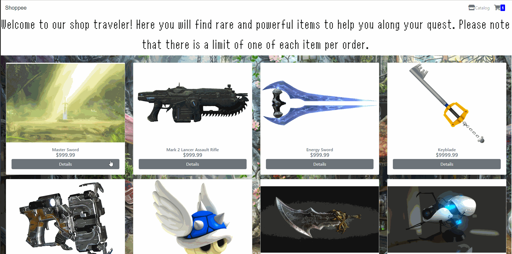

# theShoppe

A full stack LAMP & React shopping cart app.

## Technologies Used
- React.js
- Webpack 4
- Reactstrap
- Bootstrap 4
- PHP
- mySQL
- HTML5
- CSS3
- AWS EC2

## Live Demo
Try the application live at https://wicked-sales.ivanarregoitia.com/

## Features
- User can browse our fine catalog
- User can adda product to their cart
- User can view their cart, delete an item from the cart, and continue to the checkout form
- User can complete their order by filling out the checkout form

## Preview


## Getting Started

1. Fork and clone from this repository onto your local machine.
 ```
 $ git clone https://github.com/[user_name]/theShoppe.git
  ```   
2. In your terminal, navigate into the cloned directory and install the required dependencies
```
$ npm install
```
3. Create a database titled shoppee in phpMyAdmin and import the shoppee.sql file

4. Ensure that the Apache service is installed and running

5. Initiate the dev server
```
$ npm run dev
```
6. In your local browser go to ```localhost:3000```

7. The Shoppee is ready to go!

## NPM Scripts

- `dev` - Start Webpack Dev Server at port `localhost:3000`
- `build` - Run Webpack to build the React client into `server/public`.


